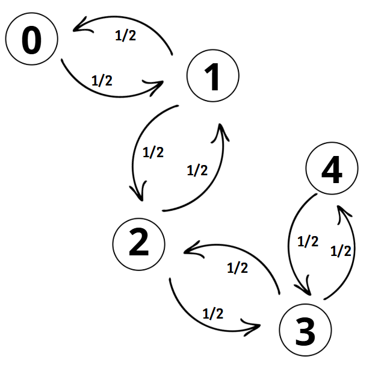

```{r setup, echo=FALSE}

library(knitr)
library(ggplot2)
```


1 - a definição do processo estocástico (cadeia de Markov);

Suponha que $U=(U_{1},U_{2},U_{3}...)$ é uma sequência de variáveis aleatória independetes, com valores entre 1 e -1 e probabilidades $p \in[0,1]$ e $1-p$ respectivamente. Seja $X= (X_{0},X_{1},X_{2}...)$ a soma parcial do processo associado a $U$, então:

$$X_{n}=\sum_{i=1}^{n}U_{i}$$

A sequência $X$ é chamada de passeio aleatório simples (ou somente passeio aleatório) com parametro $p$.

Agora suponha que $p=\frac{1}{2}$. Nesse caso, $X=(X_{0},X_{1},X_{2}...)$ é chamado de passeio aleatório simétrico simples (ou passeio simétrico aleatório). Em particular,

$$P(X_{i}=e_{i})=P(X_{i}=-e_{i})=\frac{1}{2d}, i=1,2,3...d.$$

Ou seja, em um passeio aleatório simétrico, o usuário se desloca aleatoriamente um passo por vez, com todas as direções possíveis sendo igualmente prováveis. Por exemplo, em duas dimensões ($d=2$), ele pode ir para cima, baixo, esquerda ou direita, com probabilidade de $\frac{1}{4}$ para cada direção.

- O termo "simétrico" refere-se ao fato de que todas as direções possíveis têm a mesma probabilidade de serem escolhidas.


Fontes:

https://stats.libretexts.org/Bookshelves/Probability_Theory/Probability_Mathematical_Statistics_and_Stochastic_Processes_(Siegrist)/11%3A_Bernoulli_Trials/11.06%3A_The_Simple_Random_Walk

https://math.uchicago.edu/~may/VIGRE/VIGRE2011/REUPapers/Johnston.pdf


2 - a matriz de transição;

### Definição de Matriz de Transição

A **matriz de transição** $P$ descreve as probabilidades de transição de um estado $i$ para outro estado $j$ em um único passo.

Para o passeio aleatório com espaço de estados $S= \mathbb{Z}$, temos:

$$
P_{i,j} =
\begin{cases}
p & \text{se } j = i+1, \\
1-p & \text{se } j = i-1, \\
0 & \text{caso contrário.}
\end{cases}
$$

### Representação da Matriz $P$

Se $S = {0, 1, 2 ,3 ,4}$ um espaço de estados discreto finito, a matriz de transição $P$ é dada por:

$$
P =
\begin{bmatrix}
P_{0,0} & P_{0,1} & P_{0,2} & P_{0,3} & P_{0,4} \\
P_{1,0} & P_{1,1} & P_{1,2} & P_{1,3} & P_{1,4} \\
P_{2,0} & P_{2,1} & P_{2,2} & P_{2,3} & P_{2,4} \\
P_{3,0} & P_{3,1} & P_{3,2} & P_{3,3} & P_{3,4} \\
P_{4,0} & P_{4,1} & P_{4,2} & P_{4,3} & P_{4,4}
\end{bmatrix}.
$$

Para o nosso caso de passeio aleatório isso poderia ser traduzido em:

$$
P =
\begin{bmatrix}
0 & p & 0 & 0 & 0 \\
1-p & 0 & p & 0 & 0 \\
0 & 1-p & 0 & p & 0 \\
0 & 0 & 1-p & 0 & p \\
0 & 0 & 0 & 1-p & 0
\end{bmatrix}.
$$

*Propriedades da Matriz de Transição*: **Estocasticidade**, **Simetria (para $p=1/2$)**, **Transições de Longo Prazo**

Como estamos trabalhando com passeio aleatório simétrico, temos $p = \frac{1}{2}$. Temos simetria pois as probabilidades de transição para frente $(i + 1)$ e para trás $(i - 1)$ são iguais!
Consequentemente, temos para assimétrico $p \neq \frac{1}{2}$.

Podemos analisar as matrizes dada a simetria e assímetria associadas e suas propriedades!

### Passeio Aleatório Simétrico $p = \frac{1}{2}$
Se $p = \frac{1}{2}$ a matriz de transição para $S={-1, 0, 1}$ seria:

$$
P =
\begin{bmatrix}
0 & \frac{1}{2} & 0 \\
\frac{1}{2} & 0 & \frac{1}{2} \\
0 & \frac{1}{2} & 0
\end{bmatrix}.
$$

*Propriedades Específicas*: **Recorrência**, **Distribuição Assintótica**

### Passeio Aleatório Assimétrico $p \neq \frac{1}{2}$
No caso assimétrico o processo favorece transições para um lado.
Por exemplo se $p = \frac{2}{3}$ a matriz para $S ={-1, 0, 1}$ seria:

$$
P =
\begin{bmatrix}
0 & \frac{2}{3} & 0 \\
\frac{1}{3} & 0 & \frac{2}{3} \\
0 & \frac{1}{3} & 0
\end{bmatrix}.
$$

*Propriedades Específicas*: **Têndencia Direcional**, **Irreversibilidade**

Só para eu salvar aqui xdd
https://stats.libretexts.org/Bookshelves/Probability_Theory/Probability_Mathematical_Statistics_and_Stochastic_Processes_(Siegrist)/11%3A_Bernoulli_Trials/11.06%3A_The_Simple_Random_Walk
https://stats.libretexts.org/Bookshelves/Probability_Theory/Introductory_Probability_(Grinstead_and_Snell)/12%3A_Random_Walks

3 - distibuição invariante e distribuição limite (quando houver);

### Distribuição invariante
A **distribuição invariante** de uma cadeia de Markov como vista em aula é uma distribuição de probabilidade $\pi = (\pi_i)$ tal que, ao aplicarmos a matriz de transição $P$, a distribuição permanece inalterada tal que:
$$
\pi P = \pi.
$$

Em nosso contexto de apresentação (passeio aleatório simétrico), teriamos

- A matriz de transição $P$ é simétrica para $p = \frac{1}{2}$
- Em espaços de estados finitos, a distribuição invariante é uniforme:

$$ \pi_i = \frac{1}{|S|} $$

- para todos os estados $i$, onde $|S|$ é o número total de estados. Isso ocorre porque as transições são igualmente prováveis em todas as direções.

**Para o nosso exemplo de espaço discreto finito $S={0, 1, 2,3}:$**
$$
P = \begin{bmatrix}
0 & \frac{1}{2} & 0 & 0 \\
\frac{1}{2} & 0 & \frac{1}{2} & 0 \\
0 & \frac{1}{2} & 0 & \frac{1}{2} \\
0 & 0 & \frac{1}{2} & 0
\end{bmatrix} \
$$

A distribuição invariante será:

$$
\pi = \left( \frac{1}{4}, \frac{1}{4}, \frac{1}{4}, \frac{1}{4} \right)
$$

### Distribuição Limite
A **distibuição limite** de uma cadeia de Markov é o estado ao qual a distribuição converge  muitas iterações da matriz da transição, isto é, quando $n \to \infty$

$$
\lim_{n \to \infty} P^n(i, j)
$$

Como vimos em aula, um **espaço de estados finitos**, a distribuição limite será igual à distribuição invariante.

Para um **espaço infinito $S= \mathbb{Z}$** o passeio simétrico não converge para uma distribuição estacionária porque o sistema "se espalha" indefinidamente. A probabilidade de estar e um estado específico diminui com o tempo!
Ou seja, se começarmos no ponto 0, após *n* passos, a posição $X_n$ do objeto será distribuída aproximadamente como uma normal com média 0 e variância n
$$
X_n ~ N(0, n)
$$

4 - classificação dos estados e da cadeia;

Por definição um estado $i$ é dito ser **recorrente** se $v_{ii}^*=1$ (a cadeira retorna ao $i$ com probabilidade 1).

O estado $i$ é dito ser transiente se ele não é recorrente.

Portanto, para a matriz de exemplo, considerando $p=\frac{1}{2}$:

$$
P =
\begin{bmatrix}
0 & 1 & 0 & 0 & 0 \\
\frac{1}{2} & 0 & \frac{1}{2} & 0 & 0 \\
0 & \frac{1}{2} & 0 & \frac{1}{2} & 0 \\
0 & 0 & \frac{1}{2} & 0 & \frac{1}{2} \\
0 & 0 & 0 & 1 & 0
\end{bmatrix}.
$$

<div style="text-align: center;">
```{r, echo=FALSE, out.width="30%"}

```
</div>

Análisando o grafo podemos notar que os estados {0,1,2,3,4} são uma classe fechada, irredutível.

George Pólya provou o seguinte teorema:

*"Um passeio aleatório simples em $\mathbb{Z}^D$ é recorrente se e somente se é simétrico e D < 3."*

Então, temos a distribuição estacionária:

$$
\pi_{i}=\frac{1}{2}\pi_{i-1}+\frac{1}{2}\pi_{i+1}
$$
A soma das probabilidades para deslocamento a esquerda e a direita são iguais, então podemos argumentar que a distribuição estacionária é constante para todos os estados.

Assim temos, para todos os estados $i$:

$$
\pi_{i}=\pi_{0}
$$

Como temos um processo recorrente e com distribuição estacionária $\pi_{i}=\pi_{0}$ concluímos que todos os estados em um processo de caminhada aleatória simétrica de dimensão 2 são recorrentes nulos.

5 - periodicidade;

6 - Tempo de primeira visita/passagem e recorrência

7 - Probabilidade de absorção

8 - Curiosidades e questões interessantes relacionadas ao problema específico.

### Exercícios

1. Considere um passeio aleatório simétrico ($p = 0.5$) Dado que $X_0 = 0$, encontre a probabilidade de retorno em $t = 2n$, ou seja, $P(X_{2n} = 0)$.

Para retornar a um estado precisamos que o número de passos a direita seja igual ao número de passos a esquerda.

Portanto a probabilidade de **um caminho** de retorno seria;
$$
p^n(1-p)^n
$$
Se tratando de um passeio aleatório simétrico essa expressão é equivalente a;
$$
(0.5)^n(0.5)^n = (0.5)^{2n}
$$

Para chegar a probabilidade precisamos multiplicar pelo número de sequências (combinações de passos) que satisfazem a condição de termos o mesmo número passos para cada lado:
$$
\binom{2n}{n} = \frac{2n!}{n!(2n-n)!}
$$

Portanto;
$$
P(X_{2n} = 0) = \binom{2n}{n}(0.5)^{2n}
$$

Note ainda que como $t$ é uma contagem do número de passos e consideramos apenas passos completos temos que $t \in \mathbb{N}$.

Logo para **t ímpar** a combinação não está definida, assim;
$$
P(X_{2n} = 0) = \binom{t}{\frac{t}{2}}p^{\frac{t}{2}}(1-p)^{\frac{t}{2}} = 0
$$
Concluímos com isso que é impossível voltar ao mesmo estado com um número ímpar de passos.

2. Usando R, simule e plote um passeio aleatório simétrico em uma dimensão com $n$ passos depois responda:
a) Houveram quantos retornos à origem? Qual foi a distância máxima da origem?
b) Repita a simulação $N$ vezes. Considere $F$ como a posição final do passeio, plote a distribuição de $F$.
c) Considerando a simulação do item anterior, qual foi o tempo médio de 1° retorno à origem?

```{r ex2}

sim_random_walk <- function(n) {

    steps <- sample(c(-1, 1), size = n, replace = TRUE, prob = c(.5, .5))
    return(cumsum(steps))
}

n_steps <- 1000
n_rep   <- 500

first_walk <- sim_random_walk(n_steps)
df         <- data.frame(step = 1:n_steps, position = first_walk)

ggplot(df, aes(x = step, y = position)) +
    geom_line() +
    labs(title = "simulação de 1 passeio aleatório",
       x     = "Passo",
       y     = "Posição") +
    theme_minimal()
```

Contando retornos ao ponto de origem, no caso $X_0 = 0$ e a distância máxima do ponto inicial;

```{r ex2a}

returns_to_0 <- sum(first_walk == 0)
max_dist     <- max(abs(first_walk))

cat("Número de retornos à origem: ", returns_to_0, "\n")
cat("Distância máxima alcançada do ponto inicial: ", max_dist, "\n")
```

Passo em que ocorreu a primeira volta a origem;

```{r}

first_return <- min(which(first_walk == 0))

if (is.finite(first_return)) {
    first_return
} else {
    cat("Não houve retorno.\n")
}
```

Distribuição da posição final considerando `r n_rep` repetições;

```{r ex2b}

all_walks    <- list()
return_times <- c()

for (i in 1:n_rep){

    all_walks[[i]]  <- sim_random_walk(n_steps)

    if (is.finite(min(which(all_walks[[i]][-1] == 0)))) {
        return_times[i] <- min(which(all_walks[[i]][-1] == 0))
    } else {
        return_times[i] <- 0
    }
}

df <- data.frame(step = rep(1:n_steps, times = n_rep),
                 position = unlist(all_walks),
                 walk = rep(1:n_rep, each = n_steps))

ggplot(df, aes(x = step, y = position, group = walk, color = as.factor(walk))) +
    geom_line(alpha = 0.7) +
    labs(title = "Trajetórias Simuladas",
         x = "Passo",
         y = "Posição",
         color = "Passeio") +
    theme_minimal() +
    theme(legend.position = "none")

df <- data.frame(final_pos = sapply(all_walks, function(walk) tail(walk, 1)))

ggplot(df, aes(x = final_pos)) +
    geom_histogram(fill = "lightblue", alpha = 0.7) +
    labs(title = "Distribuição da posição final",
         x     = "F",
         y     = "") +
    theme_minimal()
```

Estatísticas de 1° retorno ao ponto inicial:

```{r}

cat("Média do tempo de retorno:", mean(return_times[return_times > 0]), "passos.\n")

df <- data.frame(returns = return_times[return_times > 0])

ggplot(df, aes(x = returns)) +
    geom_histogram(fill = "lightgreen", alpha = 0.7) +
    labs(title = "Distribuição número de passos até o retorno",
         x = "Passos",
         y = "Frequência") +
    scale_x_continuous(limits = c(0,100)) +
    scale_y_continuous(limits = c(0,300)) +
    theme_minimal()

cat(sum(return_times == 0), "caminhos não retornaram ao estado zero.\n")
cat("Isso representa", sum(return_times == 0)/n_rep, "do total de simulações.\n")
```
