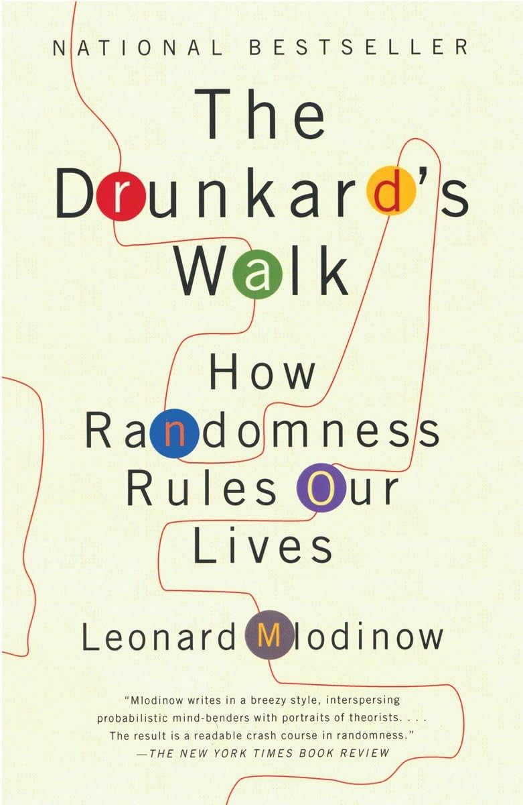
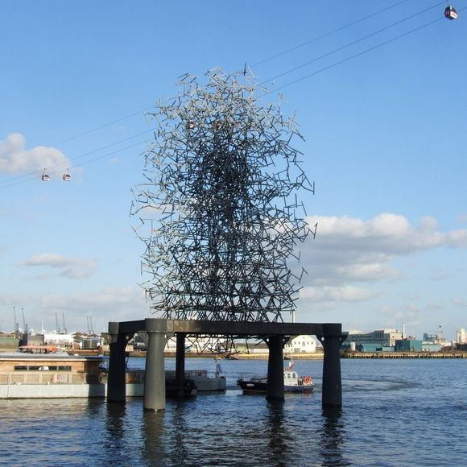

```{r setup, echo=FALSE}

knitr::opts_chunk$set(warning = FALSE)
knitr::opts_chunk$set(message = FALSE)
```
```{r libs, echo=FALSE}
library(knitr)
library(ggplot2)
library(gganimate)
library(plotly)
```

## Definição do processo estocástico (cadeia de Markov);

Suponha que $U=(U_{1},U_{2},U_{3}...)$ é uma sequência de variáveis aleatória independetes, com valores entre 1 e -1 e probabilidades $p \in[0,1]$ e $1-p$ respectivamente. Seja $X= (X_{0},X_{1},X_{2}...)$ a soma parcial do processo associado a $U$, então:

$$X_{n}=\sum_{i=1}^{n}U_{i}$$

A sequência $X$ é chamada de passeio aleatório simples (ou somente passeio aleatório) com parametro $p$.

Agora suponha que $p=\frac{1}{2}$. Nesse caso, $X=(X_{0},X_{1},X_{2}...)$ é chamado de passeio aleatório simétrico simples (ou passeio simétrico aleatório). Em particular,

$$P(X_{i}=e_{i})=P(X_{i}=-e_{i})=\frac{1}{2d}, i=1,2,3...d.$$

Ou seja, em um passeio aleatório simétrico, o usuário se desloca aleatoriamente um passo por vez, com todas as direções possíveis sendo igualmente prováveis. Por exemplo, em duas dimensões ($d=2$), ele pode ir para cima, baixo, esquerda ou direita, com probabilidade de $\frac{1}{4}$ para cada direção.

#### Esperança

Como $X_{n}$ é a soma de variáveis aleatórias $U_{i}$, a esperança de $X_{n}$ pode ser obtida:
$$
\mathbb{E}[X_{n}]=\mathbb{E}[\sum_{i=1}^{n}U_{i}]=\sum_{i=1}^{n}\mathbb{E}[U_{i}]
$$
Como $U_{i}$ assume +1 e -1 ambos com probabilidade $\frac{1}{2}$, temos:
$$
\mathbb{E}[U_{i}]=1\times\frac{1}{2}+(-1)\times\frac{1}{2}=0
$$
Portanto a esperança de $X_{n}$ é igual a zero.

Isso significa que, em média, o processo não tende para um lado específico, mas está igualmente "distribuído" ao redor da origem.

## Matriz de transição;

#### Definição de Matriz de Transição
    
A **matriz de transição** $P$ descreve as probabilidades de transição de um estado $i$ para outro estado $j$ em um único passo.

Para o passeio aleatório com espaço de estados $S= \mathbb{Z}$, temos:

$$ 
P_{i,j} = 
\begin{cases} 
p & \text{se } j = i+1, \\
1-p & \text{se } j = i-1, \\
0 & \text{caso contrário.}
\end{cases}
$$

#### Representação da Matriz $P$

Se $S = \{0, 1, 2 ,3 ,4\}$ um espaço de estados discreto finito, a matriz de transição $P$ é dada por:

$$
P = 
\begin{bmatrix}
P_{0,0} & P_{0,1} & P_{0,2} & P_{0,3} & P_{0,4} \\
P_{1,0} & P_{1,1} & P_{1,2} & P_{1,3} & P_{1,4} \\
P_{2,0} & P_{2,1} & P_{2,2} & P_{2,3} & P_{2,4} \\
P_{3,0} & P_{3,1} & P_{3,2} & P_{3,3} & P_{3,4} \\
P_{4,0} & P_{4,1} & P_{4,2} & P_{4,3} & P_{4,4} 
\end{bmatrix}. 
$$

Para o nosso caso de passeio aleatório **finito** $S =\{0,1,2,...,N\}$ a matriz de transição será uma matriz $(N+1)\times(N+1)$.

também precisamos definir umas condições de contorno:

- **Contorno reflexivo**: Se estamos no estado extremo $i=0$ ou $i=N$, o sistema "rebate" e não sai do espaço

$$
P =
\begin{bmatrix}
0.5 & 0.5 & 0 & 0 \\
0.5 & 0 & 0.5 & 0 \\
0 & 0.5 & 0 & 0.5 \\
0 & 0 & 0.5 & 0.5
\end{bmatrix}.
$$

- **Contorno absorvente**: O sistema permanece no estado extremo $i=0$ ou $i=N$

$$
P =
\begin{bmatrix}
1 & 0 & 0 & 0 \\
0.5 & 0 & 0.5 & 0 \\
0 & 0.5 & 0 & 0.5 \\
0 & 0 & 0 & 1
\end{bmatrix}.
$$

Vamos definir o **Contorno Reflexivo** para estudo e apresentação deste trabalho, pois note que definindo o contorno da matriz de transição sofremos alteração no problema todo como um geral e suas distribuições.

$$
P =
\begin{bmatrix}
1-p & p & 0 & \dots & 0 \\
1-p & 0 & p & \dots & 0 \\
0 & 1-p & 0 & \dots & p \\
\vdots & \vdots & \ddots & \ddots & \vdots \\
0 & \dots & 0 & 1-p & p \\
0 & \dots & 0 & 1-p & p
\end{bmatrix}.
$$

*Propriedades da Matriz de Transição*: **Estocasticidade**, **Simetria (para $p=1/2$)**, **Sparsa** , **Aperiodicidade**, **Irredutibilidade**, **Estacionaridade**

Como estamos trabalhando com passeio aleatório simétrico, temos $p = \frac{1}{2}$. Temos simetria pois as probabilidades de transição para frente $(i + 1)$ e para trás $(i - 1)$ são iguais!
Consequentemente, temos para assimétrico $p \neq \frac{1}{2}$.

Podemos analisar as matrizes dada a simetria e assímetria associadas e suas propriedades!

#### **4. Exemplo para \( N = 3 \) (espaço \( S = \{0, 1, 2, 3\} \))**
Com \( p = 0.5 \) e contornos reflexivos:
$$
P =
\begin{bmatrix}
0.5 & 0.5 & 0 & 0 \\
0.5 & 0 & 0.5 & 0 \\
0 & 0.5 & 0 & 0.5 \\
0 & 0 & 0.5 & 0.5
\end{bmatrix}.
$$
*Propriedades Específicas*: **Recorrência**, **Distribuição Assintótica**

#### Caso passeio Aleatório Assimétrico $p \neq \frac{1}{2}$
Com \( p = 0.66 \) e contornos reflexivos:
$$
P =
\begin{bmatrix}
0.33 & 0.66 & 0 & 0 \\
0.33 & 0 & 0.66 & 0 \\
0 & 0.33 & 0 & 0.66 \\
0 & 0 & 0.33 & 0.66
\end{bmatrix}.
$$
*Propriedades Específicas*: **Têndencia Direcional**, **Irreversibilidade**

### Exemplos de transição a **n** passos:

É interessante observar o comportamento da matriz de transição para um número grande de passos. Vamos considerar o caso de  $N = 3$  e  $p = 0.5$  e calcular a matriz de transição para $n = 2$ e $n = 3$, $n=4$ e $n=500$.

Matriz $P^2$ (transição em 2 passos):

$$
P^2 =
\begin{bmatrix}
0.5 & 0.25 & 0.25 & 0 \\
0.25 & 0.5 & 0 & 0.25 \\
0.25 & 0 & 0.5 & 0.25 \\
0 & 0.25 & 0.25 & 0.5
\end{bmatrix}.
$$

O que podemos observar aqui?

- As probabilidades de transição são mais equilibradas em relação à matriz original $P$, pois a random walk ja teve chance de "se mover" por mais de um passo.
- Apesar de se espalhar o sistema ainda não atingiu uma distribuição homogênea. A cadeia ainda possui alguma "memória" do estado inicial.
- O sistema começa a ter uma chance maior de ir para estados não-adjacentes, mas ainda há certa "preferência" por estados adjacentes.

Matriz $P^3$ (transição em 3 passos):

$$
P^3 =
\begin{bmatrix}
0.375 & 0.375 & 0.125 & 0.125 \\
0.375 & 0.125 & 0.375 & 0.125 \\
0.125 & 0.375 & 0.125 & 0.375 \\
0.125 & 0.125 & 0.375 & 0.375
\end{bmatrix}.
$$

O que podemos observar aqui?

- As probabilidades estão mais equilibradas entre os estados.
- Apesar de ainda não ser completamente uniforme, da para notar uma maior "mistura" entre os estados.
- O sistema está começando a perder memória do seu estado inicial, a cadeia está mais "descentralizada" e as probabilidades começam a se espalhar mais uniformemente.

Matriz $P^4$ (transição em 4 passos):

$$
P^4 =
\begin{bmatrix}
0.375 & 0.25 & 0.25 & 0.125 \\
0.25 & 0.375 & 0.125 & 0.25 \\
0.25 & 0.125 & 0.375 & 0.25 \\
0.125 & 0.25 & 0.25 & 0.375
\end{bmatrix}.
$$

O que podemos observar aqui?

- Após 4 passos, as probabilidades de transição entre os estados estão quase equilibradas, com uma leve tendência para os estados vizinhos
- O sistema parece estar alcançando um comportamento de **distribuição estacionárioa** (ou próxima disso pelo menos)
- Esse é um comportamento típico de uma cadeia de Markov que está perdendo sua "memória" do estado inicial e se aproximando de uma distribuição a longo prazo

Matriz $P^{500}$ (transição em 500 passos):

$$
P^{500} =
\begin{bmatrix}
0.25 & 0.25 & 0.25 & 0.25 \\
0.25 & 0.25 & 0.25 & 0.25 \\
0.25 & 0.25 & 0.25 & 0.25 \\
0.25 & 0.25 & 0.25 & 0.25
\end{bmatrix}.
$$


O que podemos observar aqui?

- A matriz $P^{500}$ nos mostra que, após um grande número de passos as probabilidades de transição entre os estados estão completamente equilibradas e uniformes
- Cada estado tem uma probabilidade de transitar para qualquer outro estado. Portanto depois de muitos passos a cadeia de Markov perde sua memória do estado inicial e atinge um estado de **equilíbrio estacionário**
- Essa distribuição uniforme de probabilidades é característica de uma cadeia de Markov irreducível e aperiódica, onde todos os estados são acessíveis e a cadeia não possui ciclos regulares.
  


3 - distibuição invariante e distribuição limite (quando houver);

#### Distribuição invariante
A **distribuição invariante** de uma cadeia de Markov como vista em aula é uma distribuição de probabilidade $\pi = (\pi_i)$ tal que, ao aplicarmos a matriz de transição $P$, a distribuição permanece inalterada tal que:
$$
\pi P = \pi.
$$

Em nosso contexto de apresentação (passeio aleatório simétrico *reflexivo*) a "particula" pode explorar todo o espaço $S = \{0,1,...,N\}$ de forma contínuam retornando os estados após atingir os extremos.

Nesse caso então a distribuição invariante neste caso será **uniforme** (pois note que o passeio é simétrico).

Se $\pi = [\pi_0, \pi_1, \dots, \pi_N]$ representa a distribuição invariante:

então

$$
\pi_i = \frac{1}{N+1}, \quad \forall i \in \{0, 1, \dots, N\}.
$$

Note que a distribuição reflete o fato de que ao longo prazo todos os estados têm a mesma probabilidade de serem visitados como confirmamos com as matrizes de transição acima.


**Para o nosso exemplo de espaço discreto finito $S={0, 1, 2,3}:$**
$$
P = \begin{bmatrix}
\frac{1}{2} & \frac{1}{2} & 0 & 0 \\
\frac{1}{2} & 0 & \frac{1}{2} & 0 \\
0 & \frac{1}{2} & 0 & \frac{1}{2} \\
0 & 0 & \frac{1}{2} & \frac{1}{2}
\end{bmatrix} \
$$

A distribuição invariante será:

$$
\pi = \left( \frac{1}{4}, \frac{1}{4}, \frac{1}{4}, \frac{1}{4} \right)
$$

*Ao longo prazo a partícula estará em qualquer estado com a mesma probabilidade*

#### Distribuição Limite
A **distibuição limite** de uma cadeia de Markov é o estado ao qual a distribuição converge  muitas iterações da matriz da transição, isto é, quando $n \to \infty$ independente da distribuição inicial $\pi^{(0)}$

$$
\lim_{n \to \infty} P^n(i, j)
$$

Como vimos em aula, um **espaço de estados finitos**, a distribuição limite será igual à distribuição invariante.

Tendo isso em mente, no nosso caso reflexivo a **distribuição limite** coincide com a distribuição invariante:

$$
\lim_{t \to \infty} P(X_t = i) = \pi_i = \frac{1}{N+1}, \quad \forall i.
$$

Isso acontece por que o controno reflexivo permite que o sistema continue a se misturar e alcançar equilíbrio uniforme.

Temos com isso algumas propriedades importantes para esse tipo de random walk:

- **Reversibilidade** : O passeio com contorno reflexivo é reversível, ou seja temos equilbrio de probabilidade tal que:

$$
\pi_i P_{ij} = \pi_j P_{ji}, \quad \forall i, j.
$$

- **Mixing Time**: O tempo necessário para atingir a distribuição uniforme (limite) depende do tamanho do espaçço $N + 1$
- **Propriedade de Confinamento** : O reflexivo evita que a partícula "escape", garantindo que a soma das probabilidades seja sempre 1.
- 

**Muda muita coisa se estamos falando de contorno absorvente?** *Muda sim, e muito!*

Se analisarmos o contexto do passeio aleatório simétrico com **contorno absorvente**, vemos que as regras de transições são modificadas, de modo que, ao atingir um dos estados do contorno ($i=0$ ou $i=N$), o processo **não pode mais sair desse estado**.

Então ao vermos a **distribuição estacionária**, temos que ver diferente do sentido clássico pois o sistema pode ser absorvido em $0$ ou $N$. No entando podemos descrever a **probabilidade de absorção** em cada estado absorvente. 

Então suponhamos que o passeio comece no estado $i (1 \leq i \leq N-1)$. 

- $P^{(0)}_i$ -> Probabiliadde do passeio ser absorvido no estado 0
- $P^{(N)}_i$ -> Probabiliadde do passeio ser absorvido no estado N

Isso pode ser modelado pelas equações de **probabilidades de absorção.**

As equações de recorrência de $P^{(0)}_i$ e $P^{(N)}_i$ são dadas por:

$$
P^{0}_i = \frac{1}{2} P_{i-1}^{(0)} + \frac{1}{2} P_{i+1}^{(0)}
$$

com as condições de contorno:

$$
P_0^{(0)} = 1, \quad P_N^{(0)} = 0.
$$


fica análogo a probabilidade de absorção em $N$:

$$
P_i^{(N)} = \frac{1}{2} P_{i-1}^{(N)} + \frac{1}{2} P_{i+1}^{(N)}
$$

com as condições de contorno:

$$
P_0^{(N)} = 0, \quad P_N^{(N)} = 1.
$$

Essas equações resolvidas de forma analítica resultam em soluções que descrevem a probabilidade de absorção de qualquer estado $i$.

Para um $P^{0}_i$ (probabilidade de ser absorvido no estado 0)

$$
P_i^{(0)} = \frac{N - i}{N}.
$$

Para um $P^{N}_i$ (probabilidade de ser absorvido no estado N)

$$
P_i^{(N)} = \frac{i}{N}.
$$

Quando falamos agora da **distribuição limite** falamos do passeio ser absorvido em um dos estados de contorno, dessa forma o processo termina.
Então a distribução limite estará concentrada nas **probabilidades de absorção $0$ e $N$**

E as probabilidades são as mesmas dadas acima para $P^{0}_i$ e $P^{N}_i$.

Essas probabilidades determinam a **distribuição limite** do processo quando o número de passos tende para o infinito, pois o processo se estabiliza no estado absorvente após um nímero suficiente de transições.

## Classificação dos estados e da cadeia;

Por definição um estado $i$ é dito ser **recorrente** se $v_{ii}^*=1$ (a cadeira retorna ao $i$ com probabilidade 1).

O estado $i$ é dito ser transiente se ele não é recorrente.

Portanto, para a matriz de exemplo, considerando $p=\frac{1}{2}$:

$$
P =
\begin{bmatrix}
\frac{1}{2} & \frac{1}{2} & 0 & 0 & 0 \\
\frac{1}{2} & 0 & \frac{1}{2} & 0 & 0 \\
0 & \frac{1}{2} & 0 & \frac{1}{2} & 0 \\
0 & 0 & \frac{1}{2} & 0 & \frac{1}{2} \\
0 & 0 & 0 & \frac{1}{2} & \frac{1}{2}
\end{bmatrix}.
$$

<div style="text-align: center;">

</div>

Análisando o grafo podemos notar que os estados {0,1,2,3,4} são uma classe fechada, irredutível.

George Pólya, em 1921, provou o teorema denominado "Teorema de Pólya" ou "Teorema da Recorrência de Caminhadas Aleatórias":

*"Um passeio aleatório simples em $\mathbb{Z}^D$ é recorrente se e somente se é simétrico e D < 3."*

Então, temos a distribuição estacionária:

$$
\pi_{i}=\frac{1}{2}\pi_{i-1}+\frac{1}{2}\pi_{i}
$$
Por exemplo:

$$
\pi_{2}=\frac{1}{2}\pi_{1}+\frac{1}{2}\pi_{2}\implies \pi_{1}=\pi_{2}
$$
Podemos mostrar que:
$$
\pi_{0}=\pi_{1}=\pi_{2}=\pi_{3}=\pi_{4}
$$
Usando a condição de normalização para essa distribuição estacionária:
$$
\pi_{0}+\pi_{1}+\pi_{2}+\pi_{3}+\pi_{4}=1
$$
Portanto
$$
\pi = (\frac{1}{5},\frac{1}{5},\frac{1}{5},\frac{1}{5},\frac{1}{5})
$$
A soma das probabilidades para deslocamento a esquerda e a direita são iguais, então podemos argumentar que a distribuição estacionária é constante para todos os estados.

Assim temos, para todos os estados $i$:

$$
\pi_{i}=\pi_{0}
$$

Como temos um processo recorrente e com distribuição estacionária $\pi_{i}=\pi_{0}$ concluímos que todos os estados em um processo de caminhada aleatória simétrica de dimensão 2 são recorrentes nulos.

Ou seja, embora o processo seja recorrente, o tempo médio para retornar ao estado inicial (ou qualquer estado específico) é infinito. O processo eventualmente retorna ao estado, mas o tempo médio de retorno é infinito.

O mesmo foi provado por George Pólya: "Em dimensões $d=2$, a caminhada aleatória simétrica é recorrente, mas o tempo médio de retorno ao ponto de origem é infinito, o que caracteriza uma recorrência nula."


## Periodicidade;
O estado $i$ tem período d se $P_{i,i}^n = 0$ sempre que $n$ não for divisível por $d$, e $d$ é o maior inteiro com essa propriedade. Por exemplo, começando no estado $i$ só sera possível o processo acessar o estado $i$ nos tempo 2,4,6,8,..., nesse caso o estado $i$ tem período 2. Um estado com período 1 é classificado como **aperiódico**. Periodicidade é uma propriedade de classe, ou seja, se o estado $i$ tem período $d$, e o estado $i$ e $j$ se comunicam, então o estado $j$ também tem período $d$.

*Referência: Sheldon, M. Ross: Introduction to probability models"

### Random Walk unidimencional e simétrica em $S= \mathbb{Z}$
Como a cadeia é irredutível, a análise do período do estado 0 se aplica a todos os estados da cadeia. Observamos que é impossível retornar ao estado 0 após um número ímpar de passos. Para retornar ao estado 0, o passeio precisa equilibrar o número de movimentos para a direita e para a esquerda, ou seja, "ganhar" n vezes e "perder" n vezes, o que só é possível após 2n passos. Isso implica que o processo é periódico com período 2, pois os retornos à origem ocorrem sempre após um número par de passos.
 
Exemplo do tempo de recorrencia ao estado zero de um random walk D = 1:
```{r,echo=FALSE}
library(ggplot2)
set.seed(150)
simular_passeio_aleatorio <- function(n_passos) {
  passos <- sample(c(-1, 1), size = n_passos, replace = TRUE)
  trajetoria <- cumsum(passos)
  tempos_zero <- which(trajetoria == 0)
  return(list(trajetoria = trajetoria, tempos_zero = tempos_zero))
 }

 n_passos <- 100
 resultado <- simular_passeio_aleatorio(n_passos)

 df <- data.frame(Passo = 1:n_passos, Posição = resultado$trajetoria)
 df_zero <- data.frame(Passo = resultado$tempos_zero, Posição = rep(0, length(resultado$tempos_zero)))

 df_legenda <- data.frame(Passo = resultado$tempos_zero)

 ggplot(df, aes(x = Passo, y = Posição)) +
  geom_line(color = "blue", size = 1) +
  geom_point(data = df_zero, aes(x = Passo, y = Posição), color = "red", size = 3) +
  geom_hline(yintercept = 0, color = "black", linetype = "dashed", size = 0.8) +
  labs(x = "t", y = "X(t)") +
  theme_minimal() +
  theme(axis.text = element_text(size = 5), axis.title = element_text(size = 14)) +
  annotate("text", x = max(df$Passo) * 0.8, y = max(df$Posição) * 0.9, 
           label = paste("Índices de Recorrência ao Zero:\n", paste(df_legenda$Passo, collapse = ", ")), 
           size = 4, hjust = 1)

```

Isso prejudica a análise de recorrência e transitoriedade, limitando a capacidade de interpretar ou prever padrões de longo prazo. Segundo o livro de Frank Spitzer: Principles of Random Walk, um passeio aleatório periódico é um processo mal formulado porque as restrições impostas pela periodicidade dificultam o estudo de propriedades essenciais, como o comportamento de longo prazo e a convergência para distribuições estacionárias.


### Transformando um passeio aleatório periódico em aperiódico:

Spitzer ressalta que, em termos da teoria dos grupos, todo passeio periódico pode ser reduzido a um caso aperiódico porque o grupo subjacente $S$ é isomorfo a um grupo $bar{S}$ de dimensão apropriada. Isso significa que, mesmo que o passeio seja originalmente periódico, existe uma maneira de reestruturar $S$ para alinhar o passeio com uma configuração aperiódica.

Um exemplo disso, é o caso em que trabalhamos com passeios aleatórios simétricos em $S = \{0, 1,...,N\}$ com bordas reflexivas, a introdução dessas bordas elimina a periodicidade do processo. Isso ocorre porque,ao atingir os limites N , o passeio é refletido, impedindo que ele siga o padrão regular de tempos de retorno típico de processos periódicos. Essa característica permite que o processo fique nos estados 0 ou N por um tempo arbitrário, tornando-o aperiódico.

Vamos simular a trajetória da matriz de transição que estamos trabalhando para verificar a aperiodicidade

$$
P = \begin{bmatrix}
\frac{1}{2} & \frac{1}{2} & 0 & 0 \\
\frac{1}{2} & 0 & \frac{1}{2} & 0 \\
0 & \frac{1}{2} & 0 & \frac{1}{2} \\
0 & 0 & \frac{1}{2} & \frac{1}{2}
\end{bmatrix} \
$$

```{r,echo=FALSE}
library(ggplot2)
set.seed(150)

simular_passeio_reflexivo <- function(n_passos, N) {
  estado <- 0
  trajetoria <- numeric(n_passos)
  trajetoria[1] <- estado
  
  for (t in 2:n_passos) {
    passo <- sample(c(-1, 1), size = 1)
    estado <- estado + passo
    
    if (estado < 0) {
      estado <- 0
    } else if (estado > N) {
      estado <- N
    }
    
    trajetoria[t] <- estado
  }
  
  return(trajetoria)
}

n_passos <- 10
N <- 3
trajetoria <- simular_passeio_reflexivo(n_passos, N)

df <- data.frame(Passo = 1:n_passos, Posição = trajetoria)
df_retornos <- df[df$Posição == 0, ]

ggplot(df, aes(x = Passo, y = Posição)) +
  geom_line(color = "blue", size = 1) +
  geom_point(data = df_retornos, aes(x = Passo, y = Posição), color = "red", size = 3) +
  geom_hline(yintercept = c(0, N), color = "black", linetype = "dashed", size = 0.8) +
  labs(
    x = "t",
    y = "X(t)"
  ) +
  scale_x_continuous(breaks = 1:n_passos) +
  theme_minimal() +
  theme(axis.text = element_text(size = 10), axis.title = element_text(size = 14))
```

Podemos verificar que o processo atinge o estado 0 em tempos arbitrários. O que indica a aperíodicidade do processo.

Características desse processo:
- irredutível
- recorrente positiva
- aperiódica

Como o processo possui essas características podemos afirmar que estamos trabalhando com uma cadeia **ergódica**, então o processo terá as seguintes propriedades:

- Terá apenas uma distribuição estacionária que é igual a distribuição limite:
$lim_{n \to \infty} P^n(i, j) = \pi_j$

- **Teorema ergódico**: Para qualquer função $f$ definida nos estados da cadeia, a média temporal converge para a média esperada sob $\pi$ quase certamente:
$\frac{1}{n} \sum_{k=1}^n f(X_k) \to \mathbb{E}_{\pi}[f(X)]$

- O tempo médio de retorno ao estado $i$, denotado por $\mathbb{E}_i[T_i]$, é inversamente proporcional à probabilidade estacionária $\pi_i$:
$\mathbb{E}_i[T_i] = \frac{1}{\pi_i}$

- A frequência relativa de visitas a um estado $i$ ao longo do tempo converge para $\pi_i$:
$\frac{\text{Número de visitas a } i}{n} \to \pi_i \quad \text{quase certamente}$

## Tempo de 1° visita/passagem e recorrência
Neste estudo, trabalharemos com a seguinte matriz de transição \( P \), que descreve um passeio aleatório simétrico e com bordas reflexivas em (\( S = \{0, 1, 2, 3\} \)):

\[
P =
\begin{bmatrix}
\frac{1}{2} & \frac{1}{2} & 0 & 0 \\
\frac{1}{2} & 0 & \frac{1}{2} & 0 \\
0 & \frac{1}{2} & 0 & \frac{1}{2} \\
0 & 0 & \frac{1}{2} & \frac{1}{2}
\end{bmatrix}
\]

O processo começa no estado \( 0 \), com uma distribuição inicial \( (1, 0, 0, 0) \).

Além disso, as propriedades analisadas neste estudo, como tempos de primeira visita, tempos de retorno e recorrência, também se aplicam a espaços de estados maiores. Por exemplo, para \( S = \{0, 1, 2, \dots, N\} \) com \( N > 3 \), o processo mantém características essenciais, como ergodicidade.

Este estudo oferece uma visão geral desses conceitos, ilustrados em um espaço de estados simples, mas aplicáveis a cenários mais amplos e complexos.


Gerando uma trajetoria de 100 passos do processo

```{r}
set.seed(150)

# Matriz de transição
P <- matrix(c(
  1/2, 1/2, 0, 0,
  1/2, 0, 1/2, 0,
  0, 1/2, 0, 1/2,
  0, 0, 1/2, 1/2
), nrow = 4, byrow = TRUE)

# Distribuição inicial
init <- c(1, 0, 0, 0) 

# Função para simular a trajetória
markov <- function(init, mat, n) { 
  X <- numeric(n + 1)
  S <- 1:length(init)
  X[1] <- sample(x = S, size = 1, prob = init)
  for (i in 2:(n + 1)) {
    X[i] <- sample(x = S, size = 1, prob = mat[X[i - 1], ])
  }
  return(X)
}

n_steps <- 100  # Número de passos
times <- 0:n_steps  # Vetor de tempo
trajetoria <- markov(init, P, n_steps)  # Gera a trajetória

trajetoria_1 <- data.frame(
  time = times,
  state = trajetoria
)

# Gráfico
library(ggplot2)
ggplot(trajetoria_1, aes(x = time, y = state)) +
  geom_line() +
  geom_point(size = 2) +
  scale_y_continuous(limits = c(1, 4)) +  # Inclui todos os estados possíveis
  labs(
    x = "Tempo (t)",
    y = "Estado"
  ) +
  theme_minimal()
```

### Tempo de Primeira Parada (Primeira Visita ao Estado 3):
O tempo de primeira visita ao estado $j$ a partir de um estado inicial $i$ é definido como o menor número de passos necessários para o passeio atingir $j$ pela primeira vez. Denotamos esse tempo como $T_j$, onde:
$T_j = \min \{ n \geq 1 \mid X_n = j \}$

Vamos analisar o comportamento da primeira chegada ao estado 3, dado que X0 = 0
```{r,message=FALSE}
n_rep <- 1000 
n_steps <- 100
Ts <- numeric(n_rep)

for (i in 1:n_rep) {
  trajetoria <- markov(init, P, n_steps)
  times <- 0:n_steps
  Ts[i] <- min(times[trajetoria == 4])
}

cat("Em média o processo visitará o estado 3 pela primeira vez no tempo: ",mean(Ts))

T_data <- data.frame(Ts = Ts)

ggplot(T_data, aes(x = Ts)) +
  geom_histogram(aes(y = ..density..), bins = 30, fill = "blue", alpha = 0.7) +
  geom_density(color = "red", size = 1) +
  labs(
    title = "Distribuição do Tempo de Primeira Chegada ao Estado 3",
    x = "Tempo de Chegada (Ts)",
    y = "Densidade"
  ) +
  theme_minimal()

```

### Tempo médio de retorno ao estado 3
Vimos anteriormente que este é um processo ergódico, portanto, esperamos que o tempo médio de retorno ao estado seja inversamente proporcional à probabilidade estacionária $pi_i$:

$\mathbb{E}_i[T_i] = \frac{1}{\pi_i}$

Portanto, esperamos que o tempo médio de retorno será de aproximadamente 4.

```{r,eval=params$run_chunk}
return_times <- numeric(n_rep) 

for (i in 1:n_rep) {
  trajetoria <- markov(init, P, n_steps)
  visits <- which(trajetoria == 4)
  if (length(visits) > 1) {
    return_times[i] <- visits[2] - visits[1]
  } else {
    return_times[i] <- NA 
  }
}

return_times_clean <- return_times[!is.na(return_times)]
tempo_medio_retorno <- mean(return_times_clean)

cat("Tempo médio de retorno ao estado 3:", tempo_medio_retorno, "\n")
```

### Tempo da k-ésima passagem pelo estado 3

```{r,eval=params$run_chunk}
set.seed(150)

n_steps <- 1000 
n_rep <- 1000
k_values <- c(2, 5, 10)
resultados <- list()

tempo_k_esima_passagem <- function(trajetoria, k, estado) {
  visitas <- which(trajetoria == estado)
  if (length(visitas) >= k) {
    return(visitas[k])
  } else {
    return(NA)
  }
}

for (k in k_values) {
  tempos <- numeric(n_rep)
  for (i in 1:n_rep) {
    trajetoria <- markov(init = c(1, 0, 0, 0), P, n_steps)
    tempos[i] <- tempo_k_esima_passagem(trajetoria, k, estado = 4)
  }
  resultados[[as.character(k)]] <- tempos[!is.na(tempos)]
}


resultados_long <- data.frame(
  k = rep(k_values, times = sapply(resultados, length)),
  tempos = unlist(resultados)
)

ggplot(resultados_long, aes(x = tempos, fill = factor(k))) +
  geom_density(aes(color = factor(k)), size = 1) +
  labs(
    x = "Tempo (n)",
    y = "Densidade",
    fill = "Valor de k",
    color = "Valor de k"
  ) +
  theme_minimal()


medias <- sapply(resultados, mean)

for (k in names(medias)) {
  cat("Média do tempo da", k, "-ésima passagem pelo estado 3:", medias[k], "\n")
}
```

A análise da \( k \)-ésima passagem pelo estado 3 está diretamente relacionada à recorrência positiva do processo. Como o passeio aleatório simétrico é recorrente, garantimos que, independentemente do estado inicial, o processo revisitará o estado 3 infinitas vezes com probabilidade 1.
Além disso, em um processo ergódico como este, o tempo médio entre visitas consecutivas a um estado é finito e inversamente proporcional à probabilidade estacionária do estado. No caso do estado 3, com \( \pi_3 = \frac{1}{4} \), o tempo médio de retorno ao estado é:

$\mathbb{E}[T_3] = \frac{1}{\pi_3} = 4$

Essa propriedade implica que, para valores de \( k \) maiores, o tempo da \( k \)-ésima passagem ao estado 3 tende a crescer linearmente com \( k \), pois o intervalo entre as passagens consecutivas permanece estável em média.

## Probabilidade de Absorção ???

## Curiosidades e Aplicações

### Random walk em duas e três dimensões
```{r 2d_walk, echo = FALSE, eval=params$run_chunk,}

walk <- function(steps) {

    x <- vector(length=steps)
    y <- vector(length=steps)

    x[1] <- 0
    y[1] <- 0

    direction <- 0
    amt       <- 0

    for (i in 2:steps) {

        direction <- rbinom(1, 1, 0.5)
        amt       <- sample(c(-1,1), 1)

        if (direction==0) {
            x[i] <- x[i - 1] + amt
            y[i] <- y[i - 1]
        }
        else {
            x[i] <- x[i - 1]
            y[i] <- y[i - 1] + amt
        }
    }
  return(data.frame(x,y, ite=1:steps))
}

df <- walk(100)

p <- ggplot(df, aes(x,y)) +
     geom_path() + geom_point() +
     theme_minimal()

a <- p + transition_reveal(along=ite)
a
```

```{r 3d_walk, echo=FALSE, eval=params$run_chunk}

walk_3d <- function(steps) {

    x <- vector(length = steps)
    y <- vector(length = steps)
    z <- vector(length = steps)

    x[1] <- 0
    y[1] <- 0
    z[1] <- 0

    for (i in 2:steps) {
        direction <- sample(1:3, 1)  # Escolhe aleatoriamente x, y ou z
        amt       <- sample(c(-1, 1), 1)   # Movimenta +1 ou -1

        if (direction == 1) {
            x[i] <- x[i - 1] + amt
            y[i] <- y[i - 1]
            z[i] <- z[i - 1]
        } else if (direction == 2) {
            x[i] <- x[i - 1]
            y[i] <- y[i - 1] + amt
            z[i] <- z[i - 1]
        } else {
            x[i] <- x[i - 1]
            y[i] <- y[i - 1]
            z[i] <- z[i - 1] + amt
        }
    }
    return(data.frame(x, y, z, ite = 1:steps))
}

df <- walk_3d(400)

fig <- plot_ly(df, x = ~x, y = ~y, z = ~z, type = 'scatter3d', mode = 'lines+markers',
               marker = list(size = 4), line = list(width = 2)) %>%
    layout(scene = list(xaxis = list(title = 'X'),
                        yaxis = list(title = 'Y'),
                        zaxis = list(title = 'Z')))
fig
```

> "A drunk man will find his way home, but a drunk bird may get lost forever."
> – Shizuo Kakutani

### Livros relacionados

||
:-------------------------:|:---------------------------:|:---------------------------

- **Mercado Financeiro:**
    - Predição do preço de ações;
    - Simulação de risco;
- Física e Química:
    - Propagação de calor;
    - Mutações genéticas;
    - Movimento de moléculas;
    - Formação de polímeros;
- Biologia:
    - Movimentos de animais;
- Computação:
    - PageRank;
    - Recomendações em Redes Sociais;

### Aplicações mais úteis

<div style="text-align: center;">

</div>


## Exercícios
### 1
Considere um passeio aleatório simétrico ($p = 0.5$) Dado que $X_0 = 0$, encontre a probabilidade de retorno em $t = 2n$, ou seja, $P(X_{2n} = 0)$.

*** Resolução ***
Para retornar a um estado precisamos que o número de passos a direita seja igual ao número de passos a esquerda.

Portanto a probabilidade de **um caminho** de retorno seria;
$$
p^n(1-p)^n
$$
Se tratando de um passeio aleatório simétrico essa expressão é equivalente a;
$$
(0.5)^n(0.5)^n = (0.5)^{2n}
$$

Para chegar a probabilidade precisamos multiplicar pelo número de sequências (combinações de passos) que satisfazem a condição de termos o mesmo número passos para cada lado:
$$
\binom{2n}{n} = \frac{2n!}{n!(2n-n)!}
$$

Portanto;
$$
P(X_{2n} = 0) = \binom{2n}{n}(0.5)^{2n}
$$

Note ainda que como $t$ é uma contagem do número de passos e consideramos apenas passos completos temos que $t \in \mathbb{N}$.

Logo para **t ímpar** a combinação não está definida, assim;
$$
P(X_{2n} = 0) = \binom{t}{\frac{t}{2}}p^{\frac{t}{2}}(1-p)^{\frac{t}{2}} = 0
$$
Concluímos com isso que é impossível voltar ao mesmo estado com um número ímpar de passos.

### 2
Usando R, simule e plote um passeio aleatório simétrico em uma dimensão com $n$ passos depois responda:
a) Houveram quantos retornos à origem? Qual foi a distância máxima da origem?
b) Repita a simulação $N$ vezes. Considere $F$ como a posição final do passeio, plote a distribuição de $F$.
c) Considerando a simulação do item anterior, qual foi o tempo médio de 1° retorno à origem?

*** Resolução ***
```{r ex2, eval=params$run_chunk}

sim_random_walk <- function(n) {

    steps <- sample(c(-1, 1), size = n, replace = TRUE, prob = c(.5, .5))
    return(cumsum(steps))
}

n_steps <- 1000
n_rep   <- 500

first_walk <- sim_random_walk(n_steps)
df         <- data.frame(step = 1:n_steps, position = first_walk)

ggplot(df, aes(x = step, y = position)) +
    geom_line() +
    labs(title = "simulação de 1 passeio aleatório",
       x     = "Passo",
       y     = "Posição") +
    theme_minimal()
```

Contando retornos ao ponto de origem, no caso $X_0 = 0$ e a distância máxima do ponto inicial;

```{r ex2a, eval=params$run_chunk}

returns_to_0 <- sum(first_walk == 0)
max_dist     <- max(abs(first_walk))

cat("Número de retornos à origem: ", returns_to_0, "\n")
cat("Distância máxima alcançada do ponto inicial: ", max_dist, "\n")
```

Passo em que ocorreu a primeira volta a origem;

```{r, eval=params$run_chunk}

first_return <- min(which(first_walk == 0))

if (is.finite(first_return)) {
    first_return
} else {
    cat("Não houve retorno.\n")
}
```

Distribuição da posição final considerando 500 repetições;

```{r ex2b, eval=params$run_chunk}

all_walks    <- list()
return_times <- c()

for (i in 1:n_rep){

    all_walks[[i]]  <- sim_random_walk(n_steps)

    if (is.finite(min(which(all_walks[[i]][-1] == 0)))) {
        return_times[i] <- min(which(all_walks[[i]][-1] == 0))
    } else {
        return_times[i] <- 0
    }
}

df <- data.frame(step = rep(1:n_steps, times = n_rep),
                 position = unlist(all_walks),
                 walk = rep(1:n_rep, each = n_steps))

ggplot(df, aes(x = step, y = position, group = walk, color = as.factor(walk))) +
    geom_line(alpha = 0.7) +
    labs(title = "Trajetórias Simuladas",
         x = "Passo",
         y = "Posição",
         color = "Passeio") +
    theme_minimal() +
    theme(legend.position = "none")

df <- data.frame(final_pos = sapply(all_walks, function(walk) tail(walk, 1)))

ggplot(df, aes(x = final_pos)) +
    geom_histogram(fill = "lightblue", alpha = 0.7) +
    labs(title = "Distribuição da posição final",
         x     = "F",
         y     = "") +
    theme_minimal()
```

Estatísticas de 1° retorno ao ponto inicial:

```{r, echo = FALSE, eval=params$run_chunk}

cat("Média do tempo de retorno:", mean(return_times[return_times > 0]), "passos.\n")

df <- data.frame(returns = return_times[return_times > 0])

ggplot(df, aes(x = returns)) +
    geom_histogram(fill = "lightgreen", alpha = 0.7) +
    labs(title = "Distribuição número de passos até o retorno",
         x = "Passos",
         y = "Frequência") +
    scale_x_continuous(limits = c(0,75)) +
    scale_y_continuous(limits = c(0,200)) +
    theme_minimal()

cat(sum(return_times == 0), "caminhos não retornaram ao estado zero.\n")
cat("Isso representa", sum(return_times == 0)/n_rep, "do total de simulações.\n")
```
